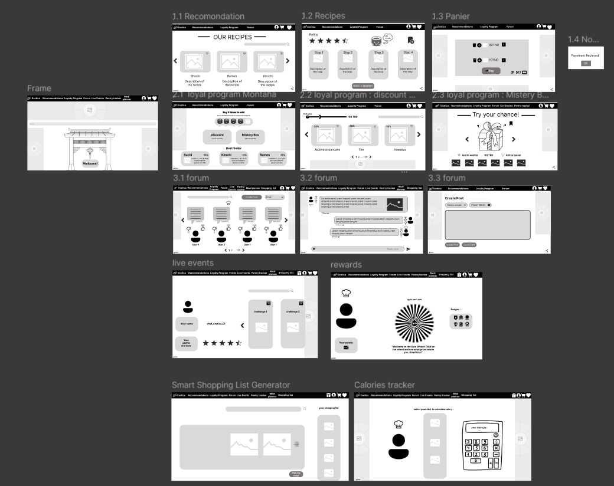
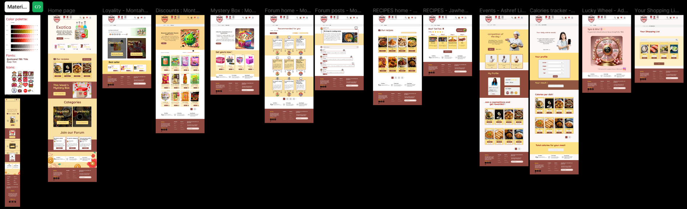

🍣 Exotica – Discover Exotic Asian Cuisine<br>
🌍 Project Overview <br>
Exotica is a web application dedicated to showcasing and exploring authentic Japanese and Asian cuisine. The platform provides detailed descriptions, recipes,mystery box , discounts and ordering options for a variety of exotic dishes.
<br>
Our team followed a structured UI/UX process, transforming ideas from prototyping to high-fidelity designs, which were then developed using React & Tailwind CSS.

🛠️ Tech Stack. <br>
Frontend: React, Tailwind CSS
Design & Prototyping: Figma
Collaboration Tools: Trello, Notion, GitHub
🎨 Design Process.
We followed a structured approach to ensure a seamless user experience:

1️⃣ Prototyping: Brainstormed ideas and created rough sketches of the platform.<br>
2️⃣ Low-Fidelity Wireframes: Defined the core layout and user journey.<br>
3️⃣ Medium-Fidelity Mockups: Improved structure and added key UI elements.<br>
4️⃣ High-Fidelity UI: Applied colors, typography, and interactions to make the design visually appealing.<br>
5️⃣ Development: Coded the Figma designs into a fully functional web app using React & Tailwind CSS.<br>
📸 Screenshots of the Figma Designs (Medium fidelity + High fidelity)<br>


👨‍🍳 Meet the Team<br>
1.Montaha Ben Jaballah - Discounts , DiscountPage , MysteryBox , LoyalityPage<br>
2.Adam Khedhira - ShoppingList, LuckyWheel , navbar<br>
3.Mohamed Nacer Adhoum - Home , ForumHome , ForumPost<br>
4.Jawher Touil - RecipePage, RecipeDetails , Home<br>
5.Achref Limem - Dishes , CaloriePerDish , Footer<br>

📦 Installation & Setup.<br>
To run the project locally:<br>
```bash
npm install
```
```bash
npm run dev
```
```bash
npm run wind
```
